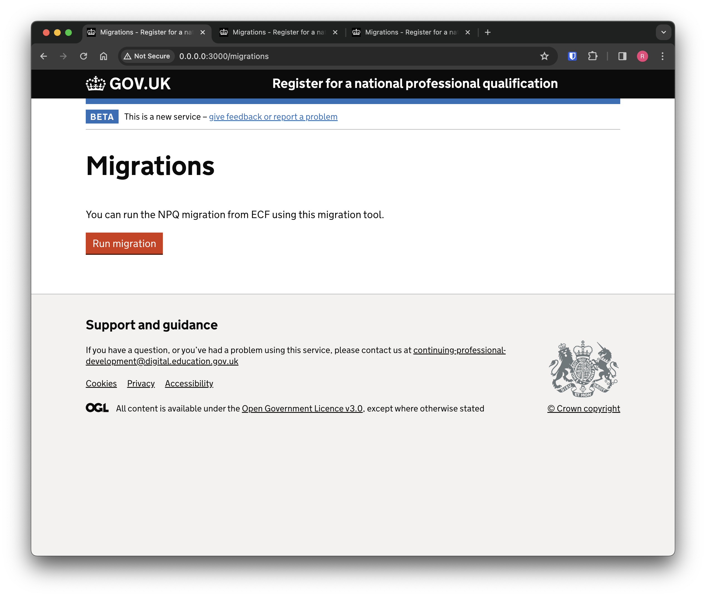
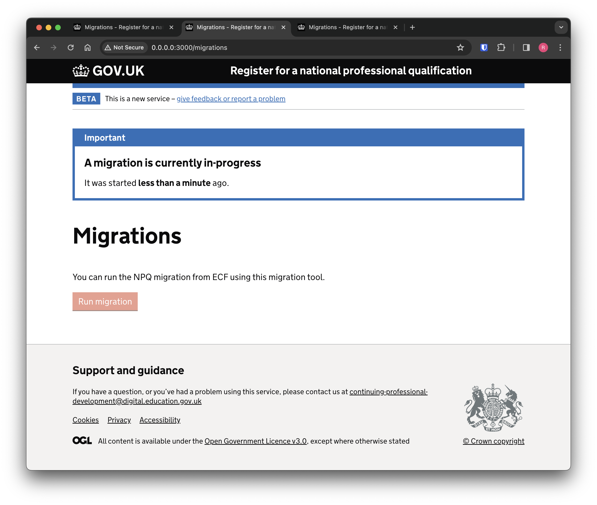
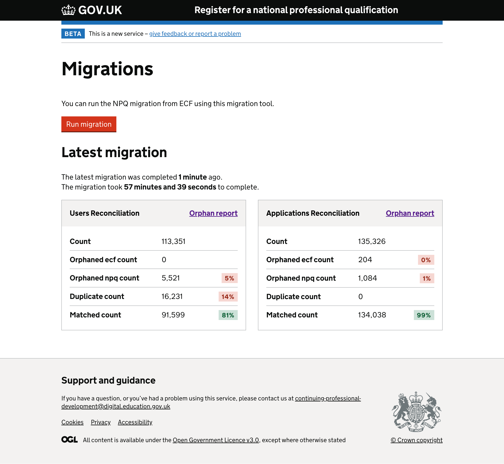

# Migration tool

As part of the NPQ separation work we need a mechanism to load data sets from both ECF and NPQ registration services and perform reconciliation where there are common models (such as with users and applications), potential data transformations (in order to save ECF data into NPQ registration) and persistence of the resulting 'ideal' data set into the new NPQ registration models, passing the stricter validation rules we will have in place.

## Starting a migration

The migration tool is only available on the migration environment, behind basic auth on the `/migrations` path (basic auth details can be obtained from the relevant key vault). In order to run a migration, you visit the `/migrations` path and hit the big red button:



## Migration progress

Migrations are ran in a background job; you can only queue a single migration run at a time:



The migration consists of:

- Reconcilation
- Data updates to NPQ registration
- Orphan reporting
- Resulting metrics

### Reconciliation

The migrator aims to reconcile common models between ECF and NPQ registration. Currently we process users and applications. This involves loading records from each service and indexing them by uniquely distinguishing attributes (so that we can check if models match in a performant manner). The attributes we take to be unique for each model are:

```
Users:

ecf_id
get_an_identity_id
trn
npq_application_ecf_ids

Applications:

ecf_id
```

So, if for any user the `ecf_id`, `get_an_identity_id`, `trn` _or any of their_ `npq_application_ecf_ids` are equal (performing a case insensitive match) we consider these users to be the same person.

The result of the reconciliation process is a set of matching records, which can be 1 or more models from ECF and NPQ registration. In an ideal world each match would have 1 ECF model and 1 corresponding NPQ registration model, but this isn't always the case.

There are two other outcomes we track as part of the reconciliation process:

- Orphans
  - This is where there is no matching data point for a model, for example a user was found in ECF that could not be matched in NPQ registration. This ECF user would be marked as an 'orphan'.
- Duplicates
  - This is where a record from one service matched _more than one_ record from the other service, for example a user in ECF matched more than one user in NPQ registration. Its important to note that some of the orphan records may in fact be duplicates but we haven't been able to reconcile them as such.

### Data updates to NPQ registration

Once we have reconciled as much of the data as possible, we iterate over the 'matched' records (where there was an exact 1 to 1 mapping between ECF and NPQ registration) and update NPQ registration with relevant information from ECF.

Currently, the only field we are updating is `lead_provider_approval_status` for the initial migration, but we expect to update more fields and perform more in-depth data manipulation in the future (in order to satisfy the more strict validation in NPQ registration, for example).

### Orphan reporting

Upon finishing the reconciliation process we are left with a number of data integrity issues by way of the orphaned records (which exist in one service but not the other). 

For these records we perform a looser 'tentative' matching process which is a best-effort way of looking up the potentially matching records on other service. The current logic we have in place is:

**Tentative matching user**

- A user exists in the other service with the same first name as the orphaned user and they are at the same school.

**Tentative matching applications**

- An application exists in the other service for the same user and with the same course name.

These rules can be updated and expanded to try and automate the matching of orphaned records with a higher success rate. The migration tool persists the details of orphans and their potential matches as Yaml files in the `Rails.cache` and they can be downloaded via the UI links.

### Resulting metrics

The result of the migration run is saved to a `Migration::Result` model. We track various metrics:

- How long the migration took to run
- For models that exist in both services we track:
  - Total count
  - Orphaned ECF (models that exist in ECF with no NPQ registration counterpart)
  - Orphaned NPQ (models that exist in NPQ registration with no ECF counterpart)
  - Duplicates (models in ECF/NPQ registration that match more than model in the other service)
  - Matched (the ideal result, which we want to trend towards 100%)

## Migration result

When the migration has finished the results will be displayed on the `/migrations` page (details of the metrics are above):



The above result was the first run we made against production data (in the migration environment).

We can see the migration took just under an hour to complete and there were `113,351` users and `135,326` applications processed. Of those, we had `0` orphaned ECF users and `204` orphaned ECF applications (that could not be matched to a record in NPQ registration). Similarly, we had `5,521` orphaned NPQ users and `1,084` orphaned NPQ applications. There were `16,231` duplicate ECF users (matched to more than 1 NPQ user) and no duplicate applications.

We had an **81%** perfect match rate for users and **91%** perfect match rate for applications.

## Next steps

Off the back of the migration performed against production we have been analysing the highlighted data integrity issue and [written up our data findings](data-integrity/migration-data-findings.md).
