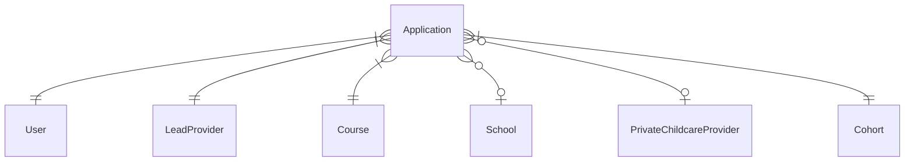
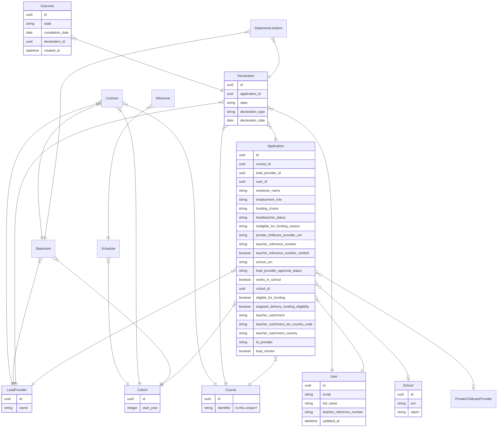
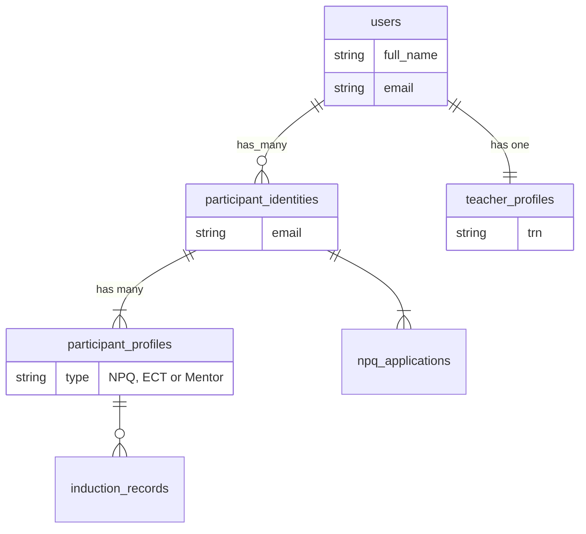
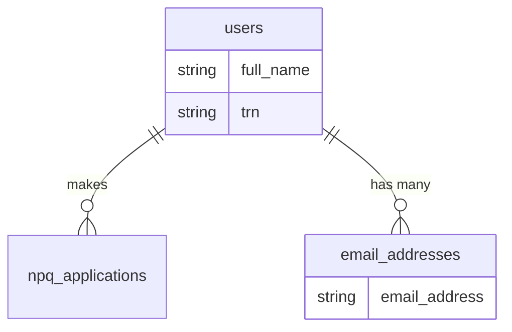

# Data modelling

The intention is to separate the NPQ application from ECF so that NPQ can operate standalone.

In order to do that we need to move NPQ data from the ECF app to the NPQ one. This document
will propose a model for storing that data.

The aim is:

* not to introduce anything unnecessary to NPQ
* to structure the data so it's easy to understand
* the queries that power the API should be simple and fast

## Current schema

* Everything hangs off the `Application`
* The foreign keys aren't currently enforced at the database level, we aim to
  fix that before building anything on top (thanks Pablo! 😄)



## Proposed schema

_This is an initial version and likely to change_.



### Things we merged

[See data integrity](./data-integrity.md).

### Things we intend to change

* use `course_id` as the foreign key between `applications` and `courses` instead of `identifier`

### Things we removed

#### Policy-specific prefixes

When sharing a database with ECF there were several tables and columns that had
to be qualified with either `ecf_` or `npq_`. When separated, the prefixes are 
superfluous and can be dropped entirely.

| Old                  | New              |
| ---                  | ---              |
| `npq_lead_providers` | `lead_providers` |
| `npq_courses`        | `courses`        |

#### ParticipantIdentity, TeacherProfile and ParticipantProfile

Completing ECF takes two years and during that time the participant's circumstances
can change many times. Not all past details about a participant are visible to
their current provider, and their current details aren't visible to their past
providers.

To cope with this complex set of requirements ECF employs a hierarchy of ownership.



This hierarchy is more complicated than necessary for NPQ.

NPQ is a much simpler process. An application is made once by the teacher
themselves. We don't need to worry about ownership or restricting access via
the API. We can probably simply allow applications to `belong_to` a user
directly.



### API sample queries

#### `/api/v3/participants/npq`

Returns all paricipants who've made appplications belonging to current lead provider.

* User
  - `id`
  - `email`
  - `full_name`
  - `teacher_reference_number`
  - `updated_at`
* LeadProvider
  - `id`
  - `name`
* Course
  - `id`
  - `identifier`
* Application
  - `id`
  - `course_id`
  - `lead_provider_id`

```ruby
User
  .joins(applications: [:lead_providers, :courses])
  .where(applications: { lead_provider: current_lead_provider } )
```

#### `/api/v3/npq-applications`

Returns all applications belonging to the current lead provider.

* Application
  - `course_id`
  - `participant_identity_id`
  - `employer_name`
  - `employment_role`
  - `funding_choice`
  - `headteacher_status`
  - `ineligible_for_funding_reason`
  - `private_childcare_provider_urn`
  - `teacher_reference_number`
  - `teacher_reference_number_verified`
  - `school_urn`
  - `school_ukprn`
  - `lead_provider_approval_status`
  - `works_in_school`
  - `cohort_id`
  - `eligible_for_funding`
  - `targeted_delivery_funding_eligibility`
  - `teacher_catchment`
  - `teacher_catchment_iso_country_code`
  - `teacher_catchment_country`
  - `itt_provider`
  - `lead_mentor`
  - `lead_provider_id`

* Course
  - `id`
  - `identifier`

* User
  - `id`
  - `full_name`

* Cohort
  - `id`
  - `integer start_year`

```ruby
Application
  .joins(:courses, :cohort, :user)
  .where(lead_provider: current_lead_provider)
```

#### `/api/v3/participants/npq/outcomes`

Outcomes for all participants with applications belonging to the current lead provider.

* Outcome
  - `id`
  - `state`
  - `completion_date`
  - `declaration_id`
  - `created_at`

* Declaration
  - `id`

* Course
  - `id`
  - `identifier`

* Application
  - `user_id`
  - `course_id`

```ruby
Outcome
  .includes(declaration: { application: :course })
  .where(declaration: { application: { lead_provider_id: current_lead_provider } } )
```

#### `/api/v3/participant-declarations`

Returns all declarations made against applications that belong to the current lead provider.

* Declaration
  - `id`
  - `state`
  - `declaration_type`
  - `declaration_date`

* Course
  - `id`
  - `identifier`

* Outcome
  - `id`
  - `state`
  - `created_at`
  - `declaration_id`

* Application
  - `id`
  - `user_id`
  - `course_id`

```ruby
Declaration
  .includes(:outcomes, application: :course)
  .where(application: { lead_provider_id: current_lead_provider })
```

## Questions

### Do we use NPQ-style numeric IDs for primary keys or switch to UUIDs?

### Should we store some data in multiple locations (eg: `application.user_id` == `application.declarations.user_id`), we can also refer to it through the parent association and be better normalised?

We agree that removing any unnecessary fields and normalising the database as much as possible is a good idea.


## Next steps

1. Statements and calculators
2. Statuses
3. History
