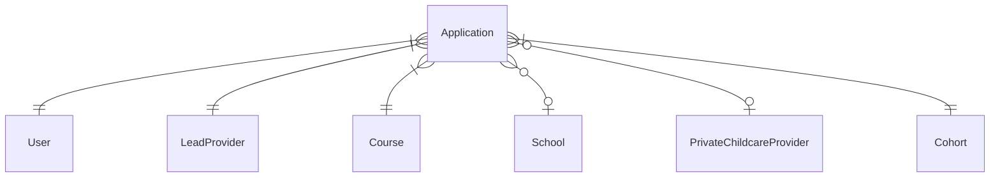
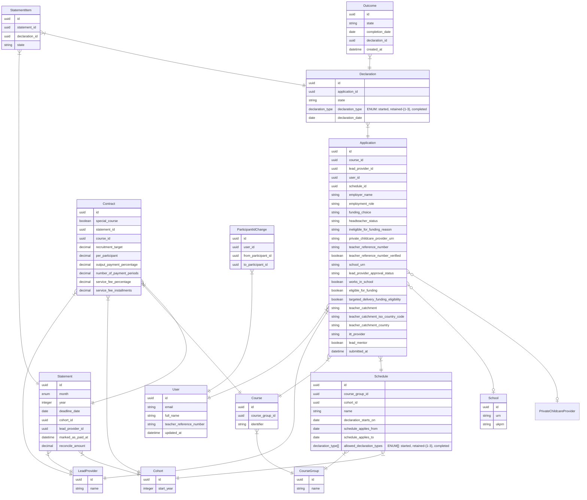
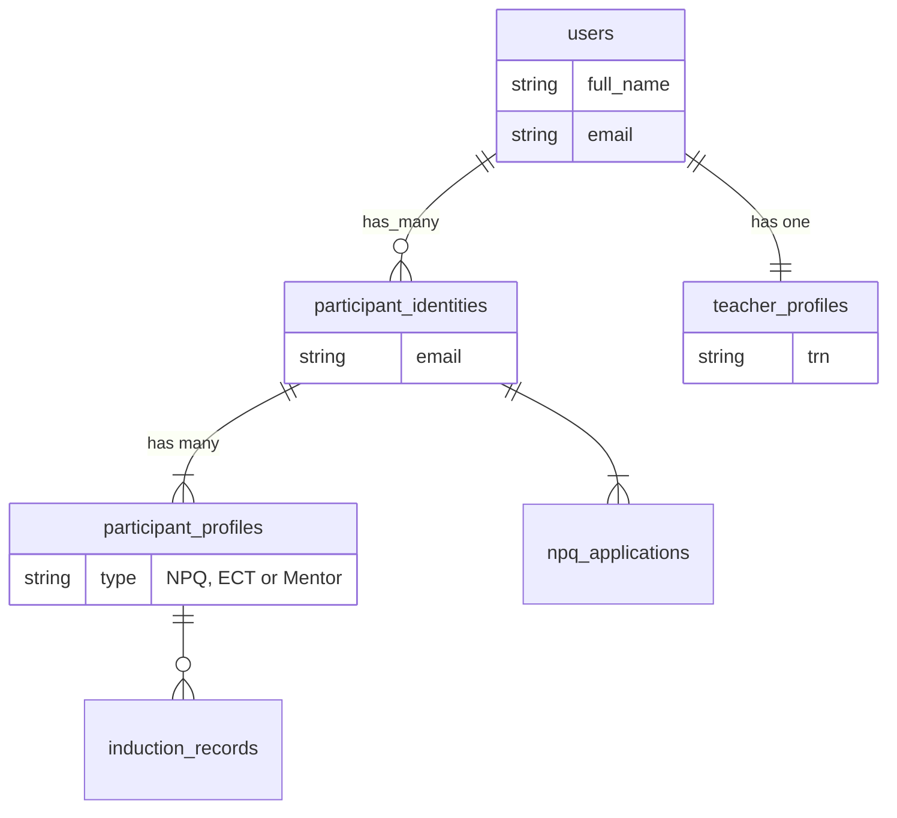
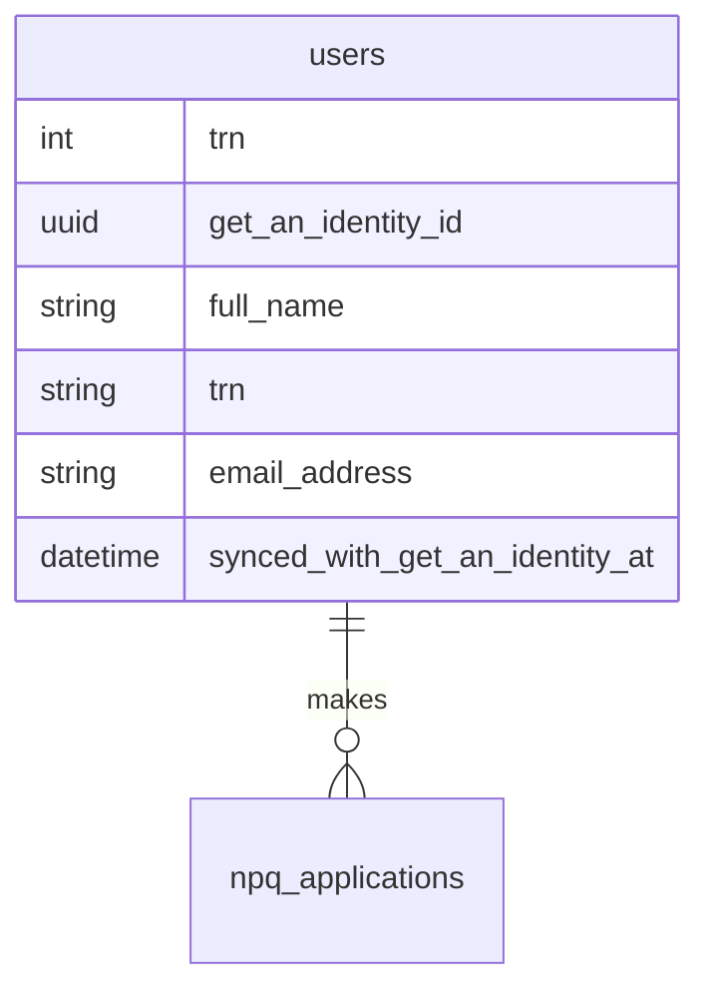

# Data modelling

The intention is to separate the NPQ application from ECF so that NPQ can operate standalone.

In order to do that we need to move NPQ data from the ECF app to the NPQ one. This document
will propose a model for storing that data.

The aim is:

* not to introduce anything unnecessary to NPQ
* to structure the data so it's easy to understand
* the queries that power the API should be simple and fast

## Current schema

* Everything hangs off the `Application`
* The foreign keys aren't currently enforced at the database level, we aim to
  fix that before building anything on top (thanks Pablo! 😄)



## Proposed schema

_This is an initial version and likely to change_.



### Things we merged

[See data integrity](./data-integrity.md).

### Things we intend to change

#### Course identifier

* use `course_id` as the foreign key between `applications` and `courses` instead of `identifier`

#### Contract + Statement redesign

Currently, a statement has one contract for every course identifier. The contract has fields that are used to calculate the statement. Contract record is shared between many statements (different months).

Over time the values change (business reasons) and we have a concept of `version` to create new contract with new values and update specific statements to use new `version`. This does not work very well. Requires a lot of work (creating new contract and bumping version) every time we need to make changes.

Suggestion - we no longer share contracts. Every statement and course identifier will have a contract. When we want to update values for specific month, we just update that particular contract only. No need to create new contract and bump version.

### Things we removed

#### Policy-specific prefixes

When sharing a database with ECF there were several tables and columns that had
to be qualified with either `ecf_` or `npq_`. When separated, the prefixes are
superfluous and can be dropped entirely.

| Old                  | New              |
| ---                  | ---              |
| `npq_lead_providers` | `lead_providers` |
| `npq_courses`        | `courses`        |

#### ParticipantIdentity, TeacherProfile and ParticipantProfile

Completing ECF takes two years and during that time the participant's circumstances
can change many times. Not all past details about a participant are visible to
their current provider, and their current details aren't visible to their past
providers.

To cope with this complex set of requirements ECF employs a hierarchy of ownership.



This hierarchy is more complicated than necessary for NPQ.

NPQ is a much simpler process. An application is made once by the teacher
themselves. We don't need to worry about ownership or restricting access via
the API. We can probably simply allow applications to `belong_to` a user
directly.



### API sample queries

<details>
  <summary>/api/v3/participants/npq</summary>

  Returns all paricipants who've made appplications belonging to current lead provider.

  * User
    - `id`
    - `email`
    - `full_name`
    - `teacher_reference_number`
    - `updated_at`
  * LeadProvider
    - `id`
    - `name`
  * Course
    - `id`
    - `identifier`
  * Application
    - `id`
    - `course_id`
    - `lead_provider_id`

  ```ruby
  User
    .joins(applications: [:lead_providers, :courses])
    .where(applications: { lead_provider: current_lead_provider } )
  ```
</details>

<details>
  <summary>/api/v3/npq-applications</summary>

  Returns all applications belonging to the current lead provider.

  * Application
    - `course_id`
    - `participant_identity_id`
    - `employer_name`
    - `employment_role`
    - `funding_choice`
    - `headteacher_status`
    - `ineligible_for_funding_reason`
    - `private_childcare_provider_urn`
    - `teacher_reference_number`
    - `teacher_reference_number_verified`
    - `school_urn`
    - `school_ukprn`
    - `lead_provider_approval_status`
    - `works_in_school`
    - `cohort_id`
    - `eligible_for_funding`
    - `targeted_delivery_funding_eligibility`
    - `teacher_catchment`
    - `teacher_catchment_iso_country_code`
    - `teacher_catchment_country`
    - `itt_provider`
    - `lead_mentor`
    - `lead_provider_id`

  * Course
    - `id`
    - `identifier`

  * User
    - `id`
    - `full_name`

  * Cohort
    - `id`
    - `integer start_year`

  ```ruby
  Application
    .joins(:courses, :cohort, :user)
    .where(lead_provider: current_lead_provider)
  ```
</details>

<details>
  <summary>/api/v3/participants/npq/outcomes</summary>

  Outcomes for all participants with applications belonging to the current lead provider.

  * Outcome
    - `id`
    - `state`
    - `completion_date`
    - `declaration_id`
    - `created_at`

  * Declaration
    - `id`

  * Course
    - `id`
    - `identifier`

  * Application
    - `user_id`
    - `course_id`

  ```ruby
  Outcome
    .includes(declaration: { application: :course })
    .where(declaration: { application: { lead_provider_id: current_lead_provider } } )
  ```
</details>

<details>
  <summary>/api/v3/participant-declarations</summary>

  Returns all declarations made against applications that belong to the current lead provider.

  * Declaration
    - `id`
    - `state`
    - `declaration_type`
    - `declaration_date`

  * Course
    - `id`
    - `identifier`

  * Outcome
    - `id`
    - `state`
    - `created_at`
    - `declaration_id`

  * Application
    - `id`
    - `user_id`
    - `course_id`

  ```ruby
  Declaration
    .includes(:outcomes, application: :course)
    .where(application: { lead_provider_id: current_lead_provider })
  ```
</details>

### Statement calculator

<details>
  <summary>Finance::NPQ::StatementsController</summary>

  * Statement
    - `id`
    - `month`
    - `year`
    - `deadline_date`
    - `cohort_id`
    - `lead_provider_id`
    - `marked_as_paid_at`

  * Contract
    - `id`
    - `special_course`
    - `statement_id`
    - `course_id`
    - `recruitment_target`
    - `per_participant`

  * Course
    - `id`
    - `name`
    - `identifier`

  * LeadProvider
    - `id`
    - `name`

  Statement the belongs to LeadProvider.
  Statement has many Contracts, one for each Course.
</details>

<details>
  <summary>Finance::NPQ::StatementCalculator</summary>

  * Statement
    - `id`
    - `reconcile_amount`
    - `lead_provider_id`

  * Course
    - `id`
    - `identifier`

  * Declaration
    - `id`
    - `state`
    - `course_id`
</details>


<details>
  <summary>Finance::NPQ::CourseStatementCalculator</summary>

  * Contract
    - `id`
    - `per_participant`
    - `output_payment_percentage`
    - `number_of_payment_periods`
    - `recruitment_target`
    - `service_fee_percentage`
    - `service_fee_installments`

  * StatementItem
    - `id`
    - `statement_id`
    - `declaration_id`

  * Declaration
    - `id`
    - `declaration_type`
    - `application_id`
    - `state`

  * Application
    - `id`
    - `user_id`

  * Statement
    - `id`
    - `lead_provider_id`

  We count declarations based on `declaration_type` and `user_id`, so
  users are not double counted.
</details>

## Questions

### Do we use NPQ-style numeric IDs for primary keys or switch to UUIDs?

### Should we store some data in multiple locations (eg: `application.user_id` == `application.declarations.user_id`), we can also refer to it through the parent association and be better normalised?

We agree that removing any unnecessary fields and normalising the database as much as possible is a good idea.

### We should have a `month` and `year` columns on Statement

Currently have `name` (eg: "September 2025"). When we want to refer and
update a statement we have to search on this column. Better to add a
`month` column with enum of months and a `year` column with validations.
Make `name` into a generated method.

### Should we store multiple emails per user, or tidy up existing data if possible?

## Next steps

1. Statements and calculators
2. Statuses
3. History
4. Validation

### How do we deal with changes?

Having had a chat with Laura on the topic, she believed that we should allow for the following:

* things that could change at any point:
  - URN
  - provider
  - training status
* things can only change pre-declaration:
  - schedule
  - cohort
* shouldn't change, require re-application:
  - course
  - eligibility
