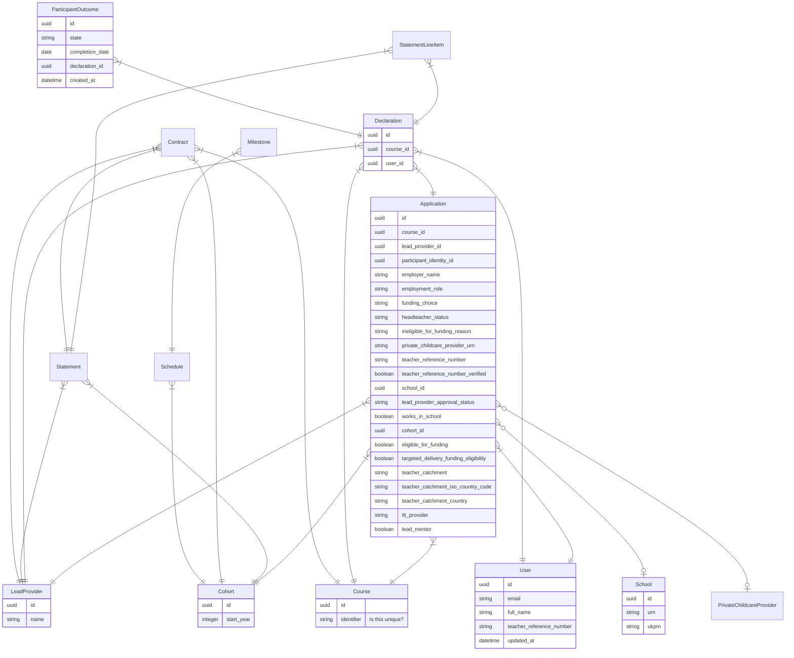

# Data modelling

The intention is to separate the NPQ application from ECF so that NPQ can operate standalone.

In order to do that we need to move NPQ data from the ECF app to the NPQ one. This document
will propose a model for storing that data.

The aim is:

* not to introduce anything unnecessary to NPQ
* to structure the data so it's easy to understand
* the queries that power the API should be simple and fast

## Proposed schema

_This is an initial version and likely to change_.



### Things we removed

#### Policy-specific prefixes
#### ParticipantProfile
#### ParticipantIdentity

### API sample queries

#### `/api/v3/participants/npq`

* User
  - `id`
  - `email`
  - `full_name`
  - `teacher_reference_number`
  - `updated_at`
* LeadProvider
  - `id`
  - `name`
* Course
  - `id`
  - `identifier`
* Application {
  - `id`
  - `course_id`
  - `lead_provider_id`

```ruby
User.joins(applications: [:lead_providers, :courses])
```
