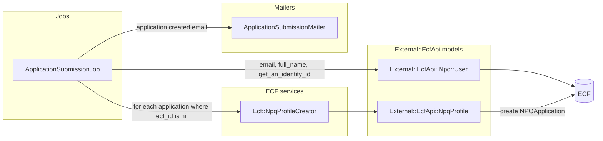
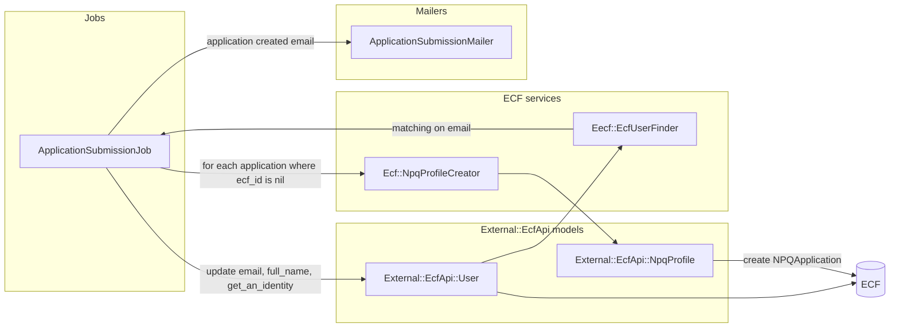
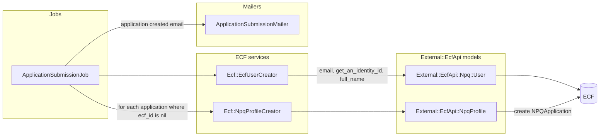
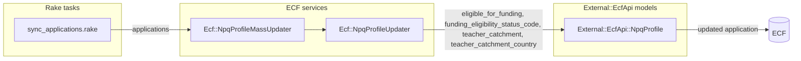
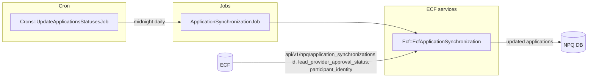
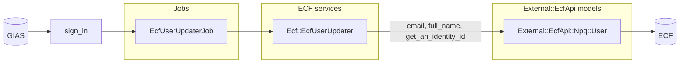
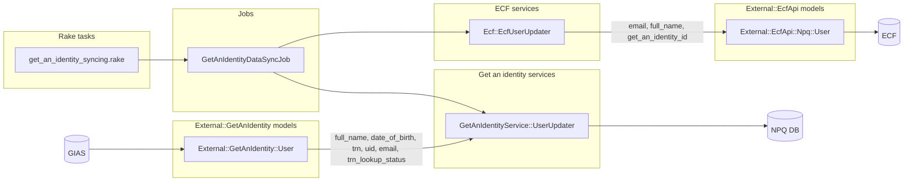
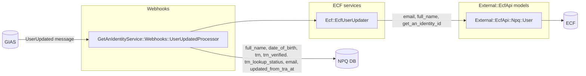

# Internal APIs

NPQ syncs or creates new users in ECF, sends/updates applications and syncs applications back for further updates (such as eligibility updates). We want to investigate why processes happens and why we would need it. We also need to evaluate if we will need any of these mechanisms once NPQ has been separated from the ECF application.

- [NPQ registration](#npq-registration)
  1. [Creating applications in ECF](#creating-applications-in-ecf)
  2. [Updating applications in ECF from NPQ registration](#updating-applications-in-ecf-from-npq-registration)
  3. [Updating applications in NPQ registration from ECF](#updating-applications-in-npq-registration-from-ecf)
  4. [Updating users in ECF](#updating-users-in-ecf)
  5. [Funding eligibility checks](#funding-eligibility-checks)
- [ECF](#ecf)
  1. [GET /api/v1/npq/application_synchronizations](#get-apiv1npqapplication_synchronizations)
  2. [POST /api/v1/npq/users](#post-apiv1npqusers)
  3. [PUT/PATCH /api/v1/npq/users](#putpatch-apiv1npqusers)
  4. [GET /api/v1/npq/users/:id](#get-apiv1npqusersid)

**TL;DR** The NPQ registration app has a bunch of models under the `External::EcfApi` namespace that are backed by `/api/v1` public APIs and further models under the `External::EcfApi::Npq` namespace that are backed by the `/api/v1/npq` private APIs in ECF.

NPQ registration creates and updates users and applications in ECF as part of application submissions and periodic syncing. Application and user data are also pulled from ECF into NPQ registration periodically and manually. The funding eligibility is also pulled from ECF to NPQ registration. When we migrate all application data into NPQ registration we shouldn't need any of the mechanisms that synchronise data. That being said, we will need to replicate the `NPQ::DedupeParticipant` logic in the NPQ registration service, as there will be duplicate records in NPQ registration that we should be reconciling when new applications are created (and the user has the same `trn` as an existing user).

## NPQ registration

> :warning: the `External::EcfApi` namespace models are backed by the [json_api_client](https://github.com/JsonApiClient/json_api_client) gem and map to the `api/v1` endpoints of the ECF service (and the `External::EcfApi::Npq` namespace maps to the `api/v1/np1` internal APIs). This means any CRUD operations on the models outlined above are against remote ECF data.

### Creating applications in ECF

- Appears to have been in NPQ registration from the beginning, see [affdda34fbcf5ceef50490ede60621eaa1932848](https://github.com/DFE-Digital/npq-registration/commit/affdda34fbcf5ceef50490ede60621eaa1932848) and [8f7289bd2e88745cf467333e5ef707a4d7d337a3](https://github.com/DFE-Digital/npq-registration/commit/8f7289bd2e88745cf467333e5ef707a4d7d337a3).

#### Journey 1 - create application (user has `ecf_id`)

When an `Application` is created in NPQ registration (via `HandleSubmissionForStore`) an `ApplicationSubmissionJob` is queued. The job:

- Retrieves the `External::EcfApi::Npq::User` for the application user and:
  - Updates the `email`, `full_name` and `get_an_identity_id` attributes with that of the application user.
- For each of the users applications that have not yet been persisted to ECF (their `ecf_id` is `nil`):
  - Call the `Ecf::NpqProfileCreator` service with the application, which will:
    - Create an `External::EcfApi::NpqProfile` for the application/user.
    - Update the `ecf_id` of the application with the resulting profile id and sets `teacher_catchment_synced_to_ecf` to `true`.
  - Emails the user via `ApplicationSubmissionMailer` to let them know their application was submitted.

#### Journey 2 - create application (user does not have `ecf_id`, matches on `email`)

When an `Application` is created in NPQ registration (via `HandleSubmissionForStore`) an `ApplicationSubmissionJob` is queued. The job:

- Calls the `Ecf::EcfUserFinder` service to retrieve a `External::EcfApi::User` with an email matching that of the application user.
  - Updates the `email`, `full_name` and `get_an_identity_id` attributes with that of the application user.
- For each of the users applications that have not yet been persisted to ECF (their `ecf_id` is `nil`):
  - Call the `Ecf::NpqProfileCreator` service with the application, which will:
    - Create an `External::EcfApi::NpqProfile` for the application/user.
    - Update the `ecf_id` of the application with the resulting profile id and sets `teacher_catchment_synced_to_ecf` to `true`.
  - Emails the user via `ApplicationSubmissionMailer` to let them know their application was submitted.

#### Journey 3 - create application (user does not have `ecf_id`, does not match on `email`)

When an `Application` is created in NPQ registration (via `HandleSubmissionForStore`) an `ApplicationSubmissionJob` is queued. The job:

- Calls the `Ecf::EcfUserCreator` with the application user, which:
  - Creates a `External::EcfApi::Npq::User` with the application users `email`, `get_an_identity_id` and `full_name`.
- For each of the users applications that have not yet been persisted to ECF (their `ecf_id` is `nil`):
  - Call the `Ecf::NpqProfileCreator` service with the application, which will:
    - Create an `External::EcfApi::NpqProfile` for the application/user.
    - Update the `ecf_id` of the application with the resulting profile id and sets `teacher_catchment_synced_to_ecf` to `true`.
  - Emails the user via `ApplicationSubmissionMailer` to let them know their application was submitted.

#### Identity Transfer

When an application is created in ECF via the API we call `save_and_dedupe_participant` on the `NPQApplication`, which:

- Saves the `NPQApplication`.
- Calls the `NPQ::DedupeParticipant` with the `npq_application` and its `teacher_reference_number`, which:
  - Does nothing if:
    - The application trn is not verified.
    - The `from_user` and `to_user` have been deduped in the past (in either direction).
    - A `from_user` or `to_user` were not found.
  - Determines the `from_user` as that of the `NPQApplication` (the user passed from NPQ registration).
  - Determines the `to_user` by finding the oldest `TeacherProfile` with a matching `trn` where the `TeacherProfile.user` is not the `from_user`.
  - Calls the `Identity::Transfer` service with the `from_user` and `to_user`, which:
    - Finds or creates a `TeacherProfile` for the `to_user`.
    - For each `ParticipantIdentity` of the `from_user`:
      - Update the `user` to be the `to_user`.
      - For each `ParticipantProfile` update the `TeacherProfile` to be the `TeacherProfile` of the `to_user`.
    - If the `from_user` and `to_user` both have an `InductionCoordinatorProfile`:
      - Sets all of the `InductionCoordinatorProfilesSchool` records for the `from_user` to be the `InductionCoordinatorProfile` of the `to_user`.
    - If just the `from_user` has an `InductionCoordinatorProfile`:
      - Update the `InductionCoordinatorProfile` of the `from_user` to belong to the `to_user`.
    - Sets the `to_user.get_an_identity_id=from_user.get_an_identity_id` and `from_user.get_an_identity_id=nil`
    - Updates the `ParticipantIdChange` records of the `from_user` to point to the `to_user`.
    - Creates a `ParticipantIdChange` on the `to_user` for the transfer.

This boils down to merging the user passed from NPQ registration into an existing user in ECF with the same `trn`.

#### Why does it do it?

A core function of the NPQ registration service is to accept applications. Once accepted, these are then managed and modified in the ECF service. As the NPQ registration service also has mechanisms for displaying user and application information this synchronization process exists.

#### Will we need this in the future?

We shouldn't most of this logic in the future; applications will only reside in NPQ registration and user state will be allowed to diverge (ideally neither service will maintain user information and instead will integrate with the get an identity service).

That being said, we will need to replicate the `NPQ::DedupeParticipant` logic in the NPQ registration service, as there will be duplicate records in NPQ registration that we should be reconciling when new applications are created (and the user has the same `trn` as an existing user).

### Updating applications in ECF from NPQ registration

- Introduced in NPQ registration with [NPQ #285](https://github.com/DFE-Digital/npq-registration/pull/285), [CPDLP-852](https://dfedigital.atlassian.net/browse/CPDLP-852).
- Introduced in ECF with [ECF #1622](https://github.com/DFE-Digital/early-careers-framework/pull/1622), [CPDLP-852](https://dfedigital.atlassian.net/browse/CPDLP-852).

#### Journey 1 - sync applications rake task

The `sync_applications` rake tasks retrieve NPQ registration applications with an `ecf_id` and calls `Ecf::NpqProfileMassUpdater`, which will:

- For each application:
  - Call the `Ecf::NpqProfileUpdater` with the application, which:
    - Loads the `External::EcfApi::NpqProfile` corresponding to the application's `ecf_id` and updates the:
      - `eligible_for_funding`
      - `funding_eligiblity_status_code`
      - `teacher_catchment`
      - `teacher_catchment_country`

#### Why does it do it?

It appears at one time or another the attributes we update in ECF were subject to change in NPQ registration. As far as I can tell this is no longer the case; these attributes are only written during application creation, at which point we send them to ECF anyway.

#### Will we need this in the future?

As everything application-related will only exist in the NPQ registration service we shouldn't need this mechanism.

### Updating applications in NPQ registration from ECF 

- Introduced in NPQ registration with [NPQ #819](https://github.com/DFE-Digital/npq-registration/pull/819), [CPDNPQ-1188](https://dfedigital.atlassian.net/browse/CPDNPQ-1188).
- API endpoint added to ECF with [ECF #3561](https://github.com/DFE-Digital/early-careers-framework/pull/3561), [CPDNPQ-1172](https://dfedigital.atlassian.net/browse/CPDNPQ-1172).
- Ability to change `lead_provider_approval_status` from ECF finance dashboard [ECF #2382](https://github.com/DFE-Digital/early-careers-framework/pull/2382), [CPDELP-1244](https://dfedigital.atlassian.net/browse/CPDLP-1244).
- Ability for users to view past applications in NPQ registration [NPQ #789](https://github.com/DFE-Digital/npq-registration/pull/789), [CPDNPQ-1086](https://dfedigital.atlassian.net/browse/CPDNPQ-1086).
- Improve review app behavior in NPQ registration [NPQ #1057](https://github.com/DFE-Digital/npq-registration/pull/1057), [CPDNPQ-1343](https://dfedigital.atlassian.net/browse/CPDNPQ-1343).

#### Journey 1 - update application statuses cron job

The cron task `Crons::UpdateApplicationsStatusesJob` is scheduled to run the `ApplicationSynchronizationJob` daily at midnight. The job runs the `Ecf::EcfApplicationSynchronization` service. The service will:

- Make a request to `api/v1/npq/application_synchronizations` on ECF, which is a private API endpoint.
  - Return the `id`, `lead_provider_approval_status` and `participant_identity_id` applications updated in the last week.
- For each application returned from ECF:
  - Find the corresponding application in NPQ registration (matching on `ecf_id`).
  - Update the `lead_provider_approval_status` and `participant_outcome_state`.

#### Why does it do it?

Once an application has been sent through to ECF the `lead_provider_approval_status` and `participant_outcome_state` can be changed in several places:

- A finance user can change the `lead_provider_approval_status` of an application.
- When an application is accepted/rejected the `lead_provider_approval_status` is updated.
- :warning: the `participant_outcome_state` does not appear to change in ECF and I couldn't find any record of it changing in the git history.

As this information is displayed in NPQ registration (users can view their past applications in the account page) it needs to be up-to-date/relevant.

#### Will we need this in the future?

As everything application-related will only exist in the NPQ registration service we shouldn't need this mechanism.

### Updating users in ECF

- Sign in update introduced in NPQ registration with [NPQ #994](https://github.com/DFE-Digital/npq-registration/pull/994).
- Rake task to update users with [NPQ #723](https://github.com/DFE-Digital/npq-registration/pull/723), [CPDNPQ-903](https://dfedigital.atlassian.net/browse/CPDNPQ-903).
- Get an identity webhooks added with [NPQ 738](https://github.com/DFE-Digital/npq-registration/pull/738), [CPDNPQ-909](https://dfedigital.atlassian.net/browse/CPDNPQ-909).

#### Journey 1 - sign in

When a user signs in to NPQ registration their `User` information is updated from the get an identity service (via omniauth). A `EcfUserUpdaterJob` is queued which, in turn, calls the `Ecf::EcfUserUpdater` service. The service:

- Retrieves the `External::EcfApi::Npq::User` for the application user and:
  - Updates the `email`, `full_name` and `get_an_identity_id` attributes with that of the application user.

#### Journey 2 - get an identity data sync job

When the `GetAnIdentityDataSyncJob` is ran for a given user (which appears to be manually via the `get_an_identity_data_sync` rake tasks):
  - The `External::GetAnIdentity::User` entry in NPQ registration is updated with the latest information from the get an identity service.
  - The `Ecf::EcfUserUpdater` service is called, which performs the updates outlined previously.

#### Journey 3 - get an identity webhook

When the get an identity service issues a `UserUpdated` message to the `GetAnIdentityService::Webhooks::UserUpdatedProcessor` webhook on NPQ registration:
  - If a user in NPQ registration is found with the corresponding `get_an_identity_id`:
    - If the user's `updated_from_tra_at` is later than the webhook message `sent_at`:
      - Mark the webhook message as processed/don't update the NPQ registration user.
    - Otherwise:
      - Update the NPQ registration user with attributes from the get webhook message payload:
        - `full_name` 
        - `date_of_birth`
        - `trn`
        - `trn_verified`, 
        - `trn_lookup_status`, 
        - `email`
      - Call the `Ecf::EcfUserUpdater` service, which performs the updates outlined previously.

#### Why does it do it?

If the user decides to change their personal details in the get an identity service (via the NPQ registration account page), then the details in ECF will no longer match.

#### Will we need this in the future?

We shouldn't need this in the future; user state will be allowed to diverge (ideally neither service will maintain user information and instead will integrate with the get an identity service).

### Funding eligibility checks

- Introduced in NPQ registration with [NPQ #600](https://github.com/DFE-Digital/npq-registration/pull/600), [CPDNPQ-723](https://dfedigital.atlassian.net/browse/CPDNPQ-723).

#### Journeys

The `FundingEligibility` calls out to ECF to check eligibility and is entwined in quite a few places:

- On various steps of the application questionnaire via checking `funding_eligiblity_status_code`:
  - `Questionnaires::ChooseYourNpq`
  - `Questionnaires::ChooseYourProvider`
  - `Questionnaires::EhcoNewHeadteacher`
  - `Questionnaires::IneligibleForFunding`
- On creating an application via `HandleSubmissionForStore` via `previously_received_targeted_funding_support?`.
- Via the `EmailTemplate`.

#### Why does it do it?

These checks are pulled from ECF to check if the user has already received targeted delivery funding for the course they have selected on an accepted application.

#### Will we need this in the future?

As we're moving all application data into NPQ registration we should be able to determine if an applicant has been previously funded for a course without talking to ECF. I also checked with Nathan and NPQ funding eligibility has no bearing on ECF training, so we shouldn't need to push this information from NPQ registration to ECF.

## ECF

### GET /api/v1/npq/application_synchronizations

- Introduced in [ECF #3561](https://github.com/DFE-Digital/early-careers-framework/pull/3561), [CPDNPQ-1172](https://dfedigital.atlassian.net/browse/CPDNPQ-1172).

#### What does it do?

Retrieves all `NPQApplication` records that have been updated in the last week, returning the `id`, `lead_provider_approval_status` and `participant_identity_id`.

#### Why does it do it?

See [Updating applications in NPQ registration from ECF](#updating-applications-in-npq-registration-from-ecf).

#### Will we need this in the future?

We shouldn't need this in the future as all application data will be in NPQ registration.

### POST /api/v1/npq/users

- Introduced in [ECF #2919](https://github.com/DFE-Digital/early-careers-framework/pull/2919), [CPDNPQ-713](https://dfedigital.atlassian.net/browse/CPDNPQ-713).

#### What does it do?

- Calls the `NPQ::Users::FindOrCreateBy` service, which:
  - Attempts to match an existing user on `get_an_identity_id` (updating the `email` if found).
  - Returns a users matching on `email` if a match on `get_an_identity_id` can't be found.
  - Creates a new user if no matches are found.

#### Why does it do it?

See [Creating applications in ECF](#creating-applications-in-ecf).

#### Will we need this in the future?

We shouldn't need this in the future; user state will be allowed to diverge (ideally neither service will maintain user information and instead will integrate with the get an identity service).

### PUT/PATCH /api/v1/npq/users

- Introduced in [ECF #2968](https://github.com/DFE-Digital/early-careers-framework/pull/2968), [CPDNPQ-880](https://dfedigital.atlassian.net/browse/CPDNPQ-880).

#### What does it do?

- Calls the `Identity` service to retrieve an existing user:
  - Matches on `external_identifier` if an `id` is specified.
  - Matches on an `email` if an `email` is specified.
  - Finds by any other attributes past in (`full_name`, for example).
- Updates the matched user with the specified params.

#### Why does it do it?

See [Creating applications in ECF](#creating-applications-in-ecf) and [Updating users in ECF](#updating-users-in-ecf).

#### Will we need this in the future?

We shouldn't need this in the future; user state will be allowed to diverge (ideally neither service will maintain user information and instead will integrate with the get an identity service).

### GET /api/v1/npq/users/:id

- Introduced in [ECF #2968](https://github.com/DFE-Digital/early-careers-framework/pull/2968), [CPDNPQ-880](https://dfedigital.atlassian.net/browse/CPDNPQ-880).

#### What does it do?

- Calls the `Identity` service to retrieve an existing user:
  - Matches on `external_identifier` if an `id` is specified.
  - Matches on an `email` if an `email` is specified.
  - Finds by any other attributes past in (`full_name`, for example).

#### Why does it do it?

See [Creating applications in ECF](#creating-applications-in-ecf) and [Updating users in ECF](#updating-users-in-ecf).

#### Will we need this in the future?

We shouldn't need this in the future; user state will be allowed to diverge (ideally neither service will maintain user information and instead will integrate with the get an identity service).

### GET /api/v1/npq/previous_funding

- Controller introduced in [ECF #3041](https://github.com/DFE-Digital/early-careers-framework/pull/3041), [CPDNPQ-883](https://dfedigital.atlassian.net/browse/CPDNPQ-883).
- Service added in [ECF #2120](https://github.com/DFE-Digital/early-careers-framework/pull/2120), [CPDLP-1335](https://dfedigital.atlassian.net/browse/CPDLP-1335).

#### What does it do?

- Calls the `NPQ::FundingEligibility` service with the given `trn`, `get_an_identity_id` and `npq_course_identifier`, which:
  - Determines the `previously_funded` status, which is `true` if:
    - There are accepted applications that are eligible for funding.
  - Determines the `previously_received_targeted_funding_support` status, which is `true` if:
    - There are accepted applications that are eligible for funding and have `targeted_delivery_funding_eligibility=true`

#### Why does it do it?

The NPQ registration service calls this via the `External::EcfApi::Npq::PreviousFunding` model, which is used in the `FundingEligibility` service. See [Funding eligibility checks](#funding-eligibility-checks).

#### Will we need this in the future?

We shouldn't need this in the future as all application data will be in NPQ registration.
