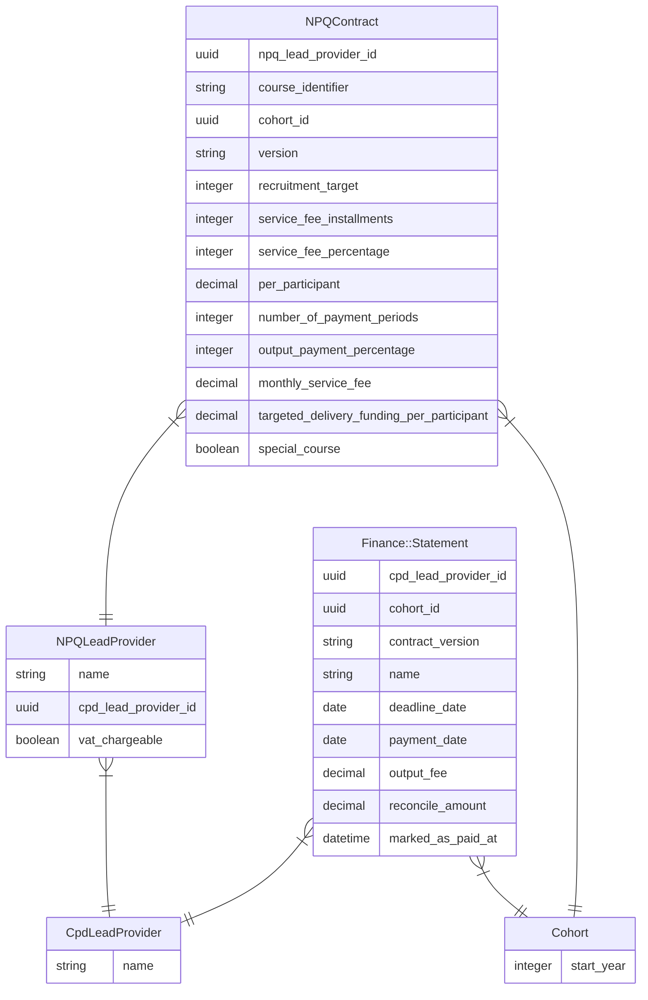
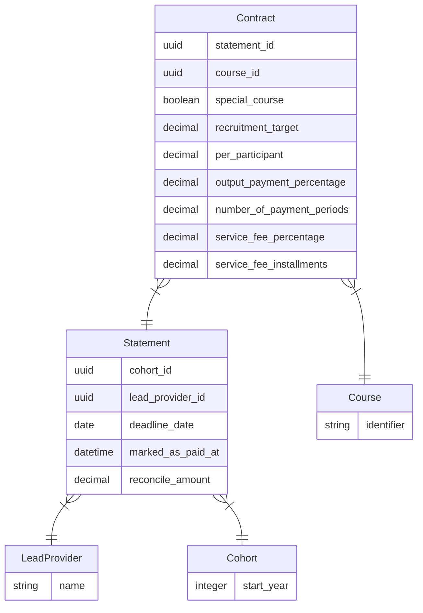
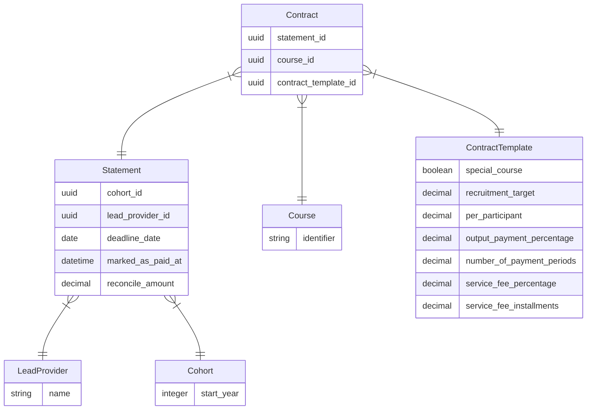

# Statement Contracts modelling

Ticket URL: https://dfedigital.atlassian.net/browse/CPDLP-2690

Purpose of this document is to revisit the relationship between
contracts, statements and versioning.

This document will propose a new model that should make it simpler to
update contract data for statements, whether we do this in `rails
console` or through admin UI.

## Current schema



Contracts have "versions". When querying the version has to be
specified:

```ruby
statement = cpd_lead_provider.npq_lead_provider.statements.find(params[:id])
npq_contracts = cpd_lead_provider.npq_lead_provider.npq_contracts.where(
  version: statement.contract_version,
  cohort: statement.cohort,
).order(course_identifier: :asc)
```

The `version` column is a string, which loosely follows Semantic Versioning, and has no validation.
Ordering therefore cannot be guaranteed.

The difficulty comes when we want to update a contract to new value.

An example of [script to set special_course](https://github.com/DFE-Digital/early-careers-framework/blob/main/app/services/oneoffs/npq/set_special_course_for_npq_contracts.rb), we have to:
* Find statements related to the lead provider, cohort and date range.
* For each course (with `course_identifier`)
  * Find `NPQContract` with `statement.contract_version`
  * Duplicate the contract
  * Set new value
  * Bump up contract version
  * Update statement with new version
* Do this while not creating duplicate contracts as contract is shared
  between statements

## Proposed schema 1



Changes summary:
* Contract directly links to statement
* Contract links to course (not course_identifier)
* Contract belongs to one statement + course
* Contract is not shared by statements

Every time we want to change values, we just update the
contract thats specific to the statement and course:

```ruby
Statement.where(lead_provider:, cohort:, month: 1, year: 2023).each do |statement|
  contract = statement.contracts.where(course: "npq-leading-teaching").first
  contract.recruitment_target = 500
  contract.save!
end
```

No more duplicating.

Pros:
* Much simpler schema
* Contract belongs to only one statement
* Simple CRUD for admin UI

Cons:
* Duplication of contract values

There is a PR to remove redundant fields and add unique index:
https://github.com/DFE-Digital/npq-registration/pull/1120

## Proposed schema 2



Changes summary:
* Instead of duplicating contract values, we have a new
  `ContractTemplate`.
* Contract links to a specific template.
* We either update the template with new values or create new template
  and set contract to new `contract_template_id`

Pros:
* Reduces duplication of contract values

Cons:
* When changing contract values, we still have to duplicate a template
  and update contracts to that new template
* Extra layer and complication
* Likely more complicated admin UI

