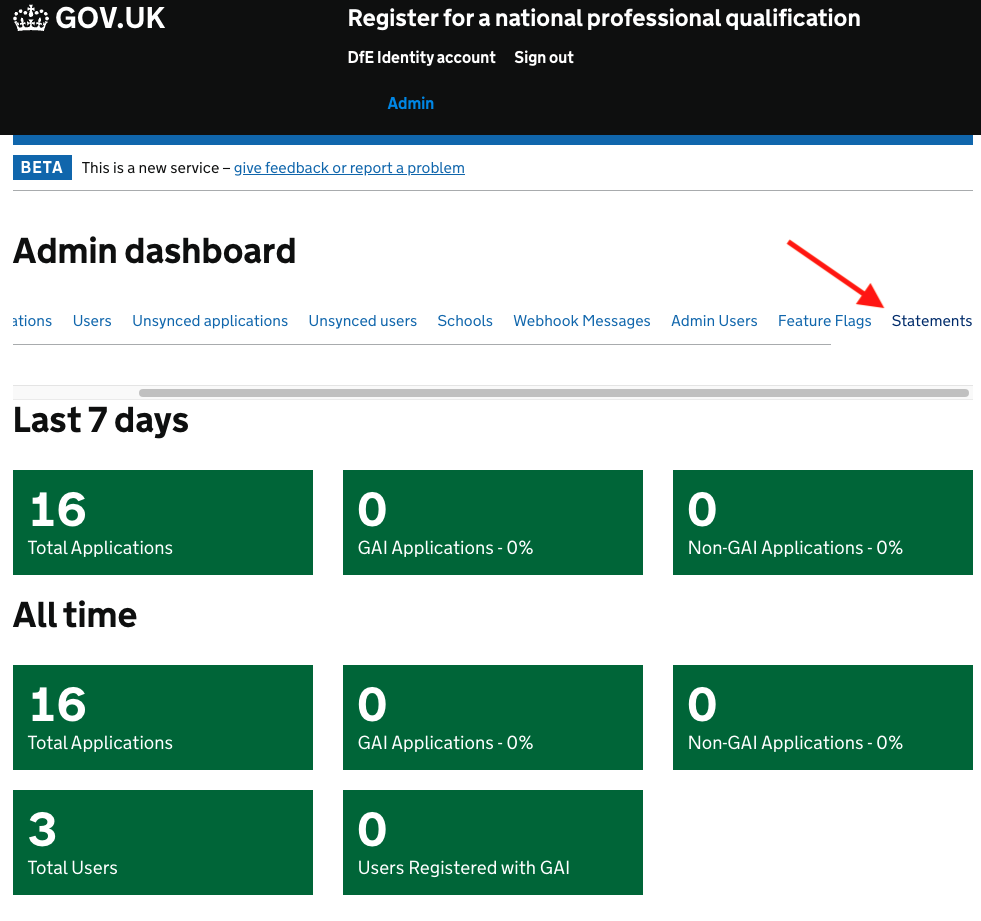
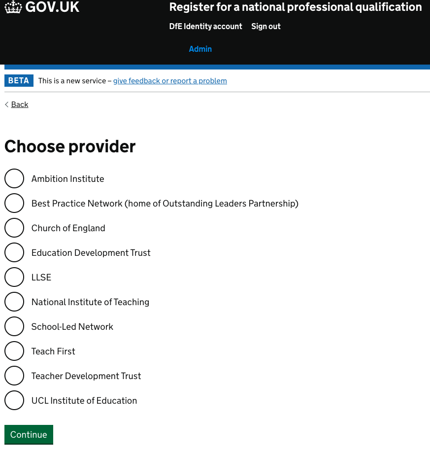
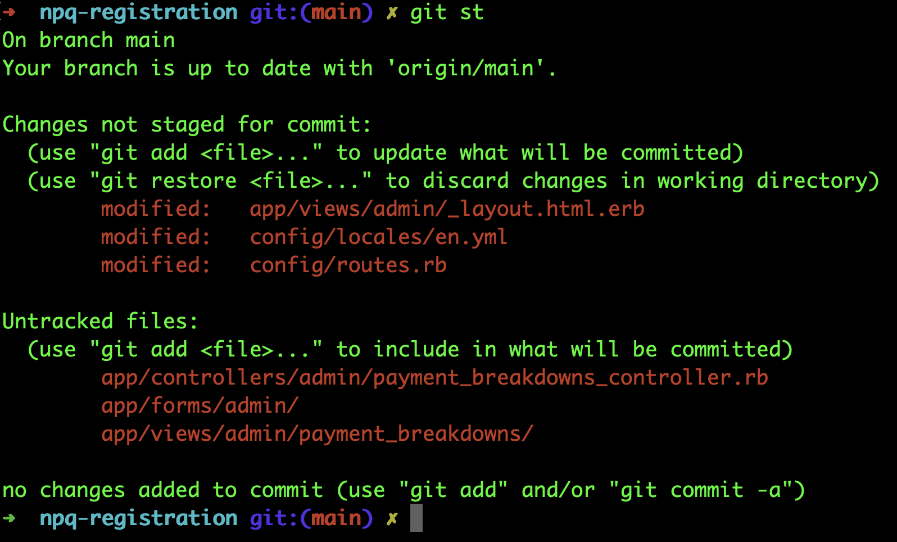

# Admin interface tooling and support features

The purpose of this document is to investigate current tooling (in finance and admin interfaces) including eligibility imports and application exports, and how we can move over what we need to. From a self-sustainability point of view, everything we store in the database we should view as something that could be editable in the admin, which could be in the future edited via a field or dropdown.

## Finance profile tools/features

| Feature                                                          | URL      | Controller          |
| --------------------------------------------------------------------- | ------------------------------------------------------------------------------------------------ | ----------------------------------------------------- |
| Finance Landing page (Manage CPD Contracts)          | /finance/manage-cpd-contracts    | finance/landing_page                             |
| Search CPD contract data (by participant, declaration or application ID)  | /finance/participants | finance/participants                            |
| Show single participant data                                        | /finance/participants/:id | finance/participants |
| Change NPQ participant training status | /finance/participant_profiles/:participant_profile_id/npq/change_training_status/new | finance/npq/change_training_statuses |
| Change NPQ participant lead provider | /finance/participant_profiles/:participant_profile_id/npq/change_training_status/new | finance/npq/change_lead_provider |
| Change NPQ application lead provider approval status | /finance/npq_applications/:npq_application_id/change_lead_provider_approval_status/new | finance/change_lead_provider_approval_statuses |
| Choose trainee payments scheme page (ECF or NPQ) | /finance/payment-breakdowns/choose-programme | finance/payment_breakdowns |
| Choose NPQ provider for statement page  | /finance/payment-breakdowns/choose-provider-npq | finance/payment_breakdowns |
| Select NPQ provider/cohort/statement dropdowns | /finance/payment-breakdowns/choose-npq-statement | finance/payment_breakdowns |
| List schedules | /finance/schedules |  finance/schedules |
| List a schedule milestone | /finance/schedules/:id |  finance/schedules |
| Download NPQ statement assurance report (Download declarations CSV) | /finance/npq/statements/:statement_id/assurance-report.csv | finance/npq/assurance_reports
| Save NPQ statement in PDF | Calls browser's print feature (Control+P) | Javascript + CSS |
| View NPQ statement | /finance/npq/payment-overviews/:lead_provider_id/statements/:id | finance/npq/statements |
| List NPQ statement voided declarations| /finance/npq/payment-overviews/:lead_provider_id/statements/:statement_id/voided | finance/npq/participant_declarations/voided |
| List NPQ statement declarations for a course | /finance/npq/payment-overviews/:lead_provider_id/statements/:statement_id/courses/:id | finance/npq/course_payment_breakdowns (**does not exist**) |
| View all NPQ statements for a lead provider | /finance/npq/payment-overviews/:id | finance/npq/payment_overviews (**does not exist**) |
| View NPQ contract information | /finance/npq/contracts/:id | finance/npq/contracts (**does not exist**) |
| Resend NPQ participant outcome | /finance/npq/participant_outcomes/:participant_outcome_id/resend | finance/npq/participant_outcomes
| Authorise NPQ statement for payment | /finance/statements/:statement_id/payment_authorisations/new | finance/payment_authorisations |

## Admin profile tools/features

| Feature                                                          | URL      | Controller          |
| --------------------------------------------------------------------- | ------------------------------------------------------------------------------------------------ | ----------------------------------------------------- |
| Admin Landing page (Overview)                                                                              | /admin /admin/performance /admin/performance/overview            | admin/performance/overview                  |
| List participants                                                                                          | /admin/participants                                                    | admin/participants                          |
| View NPQ participant details                                                                               | /admin/participants/:id /admin/participants/:participant_id/details | admin/participants                          |
| View NPQ participant change log                                                                            | /admin/participants/:participant_id/change_log                         | admin/participants/change_log               |
| NPQ participant identity confirmation                                                                      | /admin/participants/:id/validations/identity                           | admin/participants/validations              |
| NPQ participant identity confirmation final decision                                                       | /admin/participants/:id/validations/decision                           | admin/participants/validations              |
| Change NPQ participant full name                                                                           | /admin/participants/:participant_id/npq_change_full_name/edit          | admin/participants/npq/change_full_name     |
| Change NPQ participant email                                                                               | /admin/participants/:participant_id/npq_change_email/edit              | admin/participants/npq/change_email         |
| List archived participants                                                                                 | /admin/archive /admin/archive/relics                                | admin/archive/relics                        |
| Manage admin users                                                                                         | /admin/administrators                                                  |                                             |
| Add/Amend a note to a NPQ application                                                                      | /admin/npq/applications/notes/:id/edit                                 | admin/npq/applications/notes                |
| NPQ eligibility imports csv example download                                                               | /admin/npq/applications/eligibility_imports/example.csv                | admin/npq/applications/eligibility_imports  |
| NPQ eligibility imports files list                                                                         | /admin/npq/applications/eligibility_imports                            | admin/npq/applications/eligibility_imports  |
| View status of a NPQ application eligibility import                                                        | /admin/npq/applications/eligibility_imports/:id                        | admin/npq/applications/eligibility_imports  |
| NPQ Application analysis (Paid or Payable declarations made against a rejected or pending NPQ Application) | /admin/npq/applications/analysis                                       | admin/npq/applications/analysis             |
| Change NPQ application full name                                                                           | /admin/npq/applications/change_name/:id/edit                           | admin/npq/applications/change_name          |
| Change NPQ application email                                                                               | /admin/npq/applications/change_email/:id/edit                          | admin/npq/applications/change_email         |
| NPQ Applications list export                                                                               | /admin/npq/applications/exports                                        | admin/npq/applications/exports              |
| Schefule a NPQ Applications list export                                                                    | /admin/npq/applications/exports/new                                    | admin/npq/applications/exports              |
| View NPQ application change log                                                                            | /admin/npq/applications/applications/:application_id/change_logs       | admin/npq/applications/change_logs          |
| Seach NPQ applications                                                                                     | /admin/npq/applications/applications                                   | admin/npq/applications                      |
| View a NPQ application details                                                                             | /admin/npq/applications/applications/:id                               | admin/npq/applications                      |
| Search NPQ applicants (Edge Cases tab)                                                                     | /admin/npq/applications/edge_cases                                     | admin/npq/applications/edge_cases           |
| View  NPQ applicant details                                                                                | /admin/npq/applications/edge_cases/:id                                 | admin/npq/applications/edge_cases           |
| Change NPQ participant Eligible for funding status                                                         | /admin/npq/applications/eligible_for_funding/:id/edit                  | admin/npq/applications/eligible_for_funding |
| Change NPQ participant Funding eligibility status                                                          | /admin/npq/applications/eligibility_status/:id/edit                    | admin/npq/applications/eligibility_status   |

## Moving Statements feature to NPQ registration app

  
   
    <em>NPQ reg admin dashboard (with statements option)</em>

---

  
   
    <em>Select NPQ Lead Provider page</em>

---

  
   
    <em>Code Changes</em>

### Actions & Thoughts

Discuss with Jake on what we need to move over.

Set priorities levels to each of them and then when we have a final list of tools/features, we need to move over to NPQ reg app, the idea for the moving itself is to move the controller/views/concerns/helpers/tests to NPQ reg app.

Note: Authorization wise, not sure whether we'll have a unique profile with different permissions or something like we have in ECF app now where users can have different profiles (AdminProfile, FinanceProfile, LeadProviderProfile, etc) and each profile can access different parts of the app.
